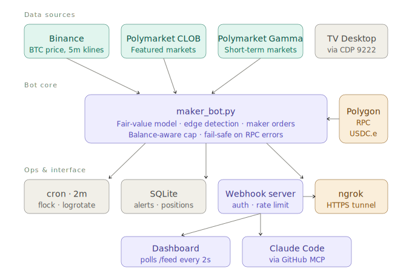

# trader-ai

Local-first AI trading assistant. Combines TradingView chart data, Binance price feed, and Polymarket prediction market odds into a unified analysis signal — reasoned by Claude CLI.

No cloud APIs. No permission dialogs. Runs entirely on your machine.

<p align="center">
  
</p>

> **Operational status**: this repo is a reference implementation. Polymarket order placement is **geographically restricted** in several jurisdictions (see [Geographic Restrictions](#geographic-restrictions) below). The code is complete and working; whether it is legal for you to run the maker bot against real funds depends on where you are.

---

## What it does

```
TradingView (CDP:9222)   Binance REST      Polymarket Gamma API
       |                      |                     |
  tv_client.py          price + momentum      market odds
  (OHLCV, indicators,        |                     |
   pine lines)               +----------+----------+
                                        |
                               signal_integrator.py
                               (async, parallel fetch)
                                        |
                               unified_prompt.py
                               (structured prompt)
                                        |
                               claude -p (subprocess)
                                        |
                               📊 Status
                               🎲 Polymarket Consensus
                               💡 Assessment
                               🧠 Rationale
                               ⚠️  Caution
                               🎯 Key levels
```

Past analyses are stored in SQLite and retrieved on the next query (RAG). The longer you run it, the deeper the context gets.

---

## Quick Start

```bash
# Install dependencies
npm install
pip install -r trader-cli/requirements.txt

# Start TradingView with CDP enabled
/Applications/TradingView.app/Contents/MacOS/TradingView \
  --remote-debugging-port=9222

# Run unified analysis (TV + Binance + Polymarket → Claude)
python trader-cli/contrib/tv_polymarket/analyze_unified.py "What is BTC doing?"

# With verbose signal preview
python trader-cli/contrib/tv_polymarket/analyze_unified.py \
  "What is BTC doing?" --verbose

# Different symbol
python trader-cli/contrib/tv_polymarket/analyze_unified.py \
  "Is SPX overextended?" --symbol SPX
```

TradingView is optional — degrades gracefully to Binance + Polymarket if not running.

---

## Copy Trading Monitor

Watches a list of Polymarket wallets and alerts on new trades in real time.

```bash
# Monitor with bot filter (default)
python trader-cli/contrib/copy_trading/monitor.py --interval 30

# Only alert on $10+ trades
python trader-cli/contrib/copy_trading/monitor.py --min-size 10

# Disable bot filter (debug)
python trader-cli/contrib/copy_trading/monitor.py --no-bot-filter

# Add a wallet to watch
python trader-cli/contrib/copy_trading/monitor.py --add 0xABC... --label ultralisk
```

Bot filter removes three noise patterns automatically:
- **Burst**: 5+ trades at the same timestamp (liquidation bots)
- **Dust**: trades under $2 (test/spam trades)
- **Near-certain**: price ≥ 0.97 (already-resolved market sweeps)

---

## Maker Bot

A Polymarket maker-only order bot. Scans BTC price markets, detects mispricing against a Binance-derived fair value, and posts limit orders on the underpriced side when the edge exceeds a configurable threshold (default 4%).

**Safety-first design:**
- `--dry-run` is the default. Pass `--live` explicitly for real orders.
- On-chain balance check (USDC.e on Polygon) runs every cycle. If it fails, the cycle halts — no fail-open paths.
- Per-cycle order cap is derived from spendable balance, never a fixed number.
- Maker-only (zero fees, small rebate). The bot never places taker orders.
- `MIN_EDGE_THRESHOLD = 0.04` — most cycles do nothing, by design.

```bash
# Dry run with CLOB + Gamma markets merged (default)
python trader-cli/contrib/maker_bot/maker_bot.py --once --verbose

# Weekly markets only, high-liquidity filter
python trader-cli/contrib/maker_bot/maker_bot.py --once --verbose \
  --source gamma --horizon weekly --min-liquidity 50000

# Live (requires .env with POLY_* + PRIVATE_KEY)
python trader-cli/contrib/maker_bot/maker_bot.py --live --max-size 3.0
```

### Fair-value model

When a market has a resolution date, the bot prices it as a **barrier-touch probability under geometric Brownian motion**. For an upper barrier K > S₀, let X_t = ln(S_t / S₀), μ = r − σ²/2, b = ln(K/S₀):

    P(max X_t ≥ b)  =  Φ((−b + μT)/(σ√T))  +  exp(2μb/σ²) · Φ((−b − μT)/(σ√T))

Dip markets (S₀ > K with "dip/below/drop/fall" in the question) are priced by the symmetric down-touch. σ is tunable via `GBM_VOL_ANNUAL`; 0.45 matched BTC's realised vol at the time of this writing. Tail markets (P outside [0.05, 0.95]) and edges above 20% are filtered as probable model error, not alpha.

### Running on a schedule

```bash
# Install a cron entry that runs the bot every 2 minutes
./trader-cli/contrib/maker_bot/cron_setup.sh install

# Status
./trader-cli/contrib/maker_bot/cron_setup.sh status

# Emergency stop (kills cron + running processes + clears lock)
./scripts/kill_bot.sh
```

Cron features: auto-detects anaconda / miniconda / homebrew paths, loads `.env`, uses `flock` if available (Linux) or falls back to `mkdir`-based locking (macOS vanilla), daily logrotate at 4am keeps 14 days of gzipped logs.

macOS users: grant Full Disk Access to `/usr/sbin/cron` in System Settings → Privacy & Security, or cron fails silently.

---

## Unified lifecycle: `trader-ctl`

Every local service — TradingView Desktop, webhook server, dashboard, ngrok, cron — can be brought up and down with a single command:

```bash
./scripts/trader-ctl up                # start everything
./scripts/trader-ctl status             # see what's running
./scripts/trader-ctl down cron          # pause the bot, leave dashboard alive
./scripts/trader-ctl logs maker_bot     # tail -f the bot log
./scripts/trader-ctl restart webhook    # bounce webhook only
```

See `scripts/trader-ctl --help` for the full list. pidfiles live in `~/.trader-ai/pids/`, logs in `~/logs/`.

---

## Dashboard

A standalone HTML dashboard (dark, vanilla JS, no framework) that polls the webhook server's `/feed` endpoint for live state.

```bash
# 1. Start the webhook server
python trader-cli/contrib/maker_bot/tv_overlay_webhook.py

# 2. Serve the dashboard statically (any static server)
cd dashboard && python -m http.server 8080

# 3. Open http://localhost:8080/?api=http://localhost:8765
```

Shows: BTC price + 5m delta (from Binance), wallet balance, positions, markets scan (fair vs market price + edge), recent alerts, and an optional TradingView chart snapshot when TV Desktop is running in debug mode.

### Demo mode

To see the dashboard with a fully populated layout without any Polymarket credentials or a funded account, start the webhook server in demo mode:

```bash
DEMO_MODE=1 python trader-cli/contrib/maker_bot/tv_overlay_webhook.py
# or equivalently
python trader-cli/contrib/maker_bot/tv_overlay_webhook.py --demo
```

In demo mode the server returns deterministic synthetic data (realistic BTC positions, markets scan, TV chart snapshot, plausible balance + open-order count) and **disables** `POST /webhook` so screenshots can't be perturbed by stray requests. Useful for screenshots, dashboard development, and onboarding contributors who haven't wired up real credentials. `/health` and `/feed` both report `demo_mode: true` so there is no ambiguity about the data source.

---

## Geographic Restrictions

Polymarket's order placement is **restricted in multiple jurisdictions**. The canonical list lives at [docs.polymarket.com/api-reference/geoblock](https://docs.polymarket.com/api-reference/geoblock) and Polymarket publishes a live endpoint to check the current user's IP:

```bash
curl -s https://polymarket.com/api/geoblock | python3 -m json.tool
```

As of this writing, fully blocked countries include the US, UK, France, Germany, Italy, Belgium, Netherlands, Russia, Iran, and several others. Close-only jurisdictions include Poland, Singapore, Thailand, and Taiwan. Japan is listed as **"Frontend UI restricted"** — the public `polymarket.com` deposit UI is blocked for JP IPs, though the on-chain CLOB endpoint itself is not IP-filtered the same way.

**This repository does not route around those restrictions.** Using a VPN to circumvent a geographic block in order to trade on a prediction market is at minimum a terms-of-service violation on Polymarket's side, and potentially a regulatory problem on your side. If you're in a blocked or UI-restricted jurisdiction, the recommended path is:

1. Use the code as a **reference implementation** for the GBM-based fair-value model, the CLOB client integration, and the cron / lock / lifecycle wiring.
2. Run it in `--dry-run` mode (the default) to see what it would do.
3. Hold any existing positions to resolution; don't deposit new funds.
4. Run the dashboard in **demo mode** (see above) if you want to see the full UI.

---

## TradingView alerts (optional, Pro+ plan)

Free-plan TradingView users can skip this — the maker bot is fully self-contained.

If you have a Pro+ plan, you can wire TV alerts into the webhook server via ngrok. See [`docs/webhook_setup.md`](docs/webhook_setup.md) for the full setup (secret generation, ngrok tunnel, Pine Script template, verification curl commands).

The `pine/polymarket_overlay.pine` reference script includes a ready-to-use momentum trigger and an `alertcondition()` that pairs with the webhook body template in the setup guide.

---

## Polymarket Market Finder

Find Polymarket markets relevant to a TradingView symbol.

```bash
python trader-cli/contrib/tv_polymarket/polymarket_markets.py --symbol BTCUSDT
python trader-cli/contrib/tv_polymarket/polymarket_markets.py --symbol SPX
```

---

## Requirements

- macOS (TradingView desktop app)
- Node.js ≥ 18
- Python ≥ 3.11 (tested on 3.14)
- Claude CLI installed and authenticated (`claude --version`)

---

## Setup

```bash
# 1. Install all dependencies
npm install
pip install -r trader-cli/requirements.txt

# 2. Verify TV CLI
npx tv status

# 3. (Optional) Register MCP server with Claude Desktop
claude mcp add --transport stdio tradingview -- \
  node /path/to/trader-ai/tradingview-mcp/src/server.js
```

---

## Architecture

| Component | Role |
|-----------|------|
| `tv_client.py` | TradingView data via CDP (symbol, OHLCV, indicators, pine lines) |
| `signal_integrator.py` | Async collection from TV + Binance + Polymarket |
| `unified_prompt.py` | Structured prompt builder for Claude |
| `analyze_unified.py` | CLI entry point + RAG retrieval + DB storage |
| `rag.py` | Symbol-aware RAG with multi-factor scoring |
| `db.py` | SQLite storage (messages, analysis_results, session) |
| `monitor.py` | Copy trading wallet monitor with bot filter |
| `polymarket_markets.py` | TV symbol → Polymarket market lookup |
| `maker_bot.py` | Polymarket maker-order bot (balance-aware, fail-safe) |
| `gamma_markets.py` | Gamma API client for short-term markets |
| `tv_overlay_webhook.py` | Webhook server (auth, rate limit, TV chart snapshot, demo mode) |
| `dashboard/` | Standalone HTML dashboard, polls `/feed` |

---

## RAG Memory

Every analysis is stored locally in `data/trader.db` and retrieved on future queries.

Symbol-aware scoring ensures BTC analyses appear when asking about BTC, not when asking about SPX. The system learns from its own history — precision improves with use.

```
data/
├── trader.db          # SQLite: messages, analysis_results, session
├── watched_wallets.json
└── seen_trades.json
```

---

## Supported Symbols

| Symbol | Polymarket keywords |
|--------|-------------------|
| BTCUSDT | bitcoin, btc |
| ETHUSDT | ethereum, eth |
| SOLUSDT | solana, sol |
| SPX / SPXUSD | s&p 500, spx |
| NAS100 | nasdaq, qqq |
| XAUUSD | gold |
| EURUSD | euro, eur/usd |
| USDJPY | yen, usd/jpy |
| AAPL / TSLA / NVDA / MSFT | company name |

---

## Project Structure

```
trader-ai/
├── dashboard/                     # Live dashboard (HTML + CSS + JS, no framework)
│   ├── index.html
│   ├── style.css
│   └── app.js
├── docs/
│   ├── architecture.svg           # Light/dark-aware architecture diagram
│   └── webhook_setup.md           # ngrok + TV alert setup (Pro+ plan)
├── pine/
│   └── polymarket_overlay.pine    # Reference Pine Script (Pro+ plan, optional)
├── scripts/
│   ├── trader-ctl                 # Unified up/down/status for local services
│   ├── trader.sh
│   ├── dev.sh
│   ├── kill_bot.sh                # Emergency stop: removes cron, kills processes
│   └── start_ngrok.sh             # ngrok tunnel helper
├── trader-cli/
│   ├── main.py                    # Legacy CLI entry (analyze, history, search)
│   ├── tv_client.py               # TradingView CDP client
│   ├── claude_client.py           # Claude CLI subprocess wrapper
│   ├── prompts.py                 # Prompt assembly + intent routing
│   ├── rag.py                     # Symbol-aware RAG retrieval
│   ├── db.py                      # SQLite storage layer
│   └── contrib/
│       ├── maker_bot/             # Polymarket maker bot
│       │   ├── maker_bot.py
│       │   ├── gamma_markets.py
│       │   ├── tv_overlay_webhook.py
│       │   └── cron_setup.sh
│       ├── tv_polymarket/         # Unified signal integration
│       │   ├── analyze_unified.py
│       │   ├── signal_integrator.py
│       │   ├── unified_prompt.py
│       │   └── polymarket_markets.py
│       ├── copy_trading/          # Wallet monitor + bot filter
│       │   ├── monitor.py
│       │   ├── leaderboard.py
│       │   └── wallet_scorer.py
│       └── polymarket_latency/    # WS latency tools
│           ├── ws_detector.py
│           └── backtest.py
├── tradingview-mcp/               # TradingView MCP server (do not modify)
└── data/
    ├── trader.db
    ├── watched_wallets.json
    └── seen_trades.json
```
